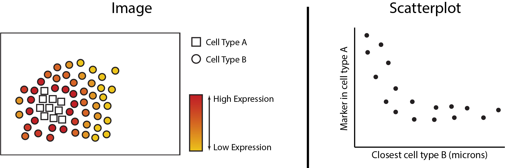

```{r, include = FALSE}
knitr::opts_chunk$set(
  #collapse = TRUE,
  eval = FALSE,
  comment = "#>",
  cache = FALSE,
  message = FALSE,
  warning = FALSE
)
```

```{=html}
<style>
.question {
  padding: 1em;
  background: lightcyan;
  color: black;
  border-radius: 10px;
}
</style>
```
**Presenting Authors**

Farhan Ameen$^{1,2,3}$, Alex Qin$^{1,2,3}$, Nick Robertson$^{1,2,3}$,
Ellis Patrick$^{1,2,3}$.

$^1$ Westmead Institute for Medical Research, University of Sydney,
Australia\
$^2$ Sydney Precision Data Science Centre, University of Sydney,
Australia\
$^3$ School of Mathematics and Statistics, University of Sydney,
Australia

<br/> Contact: ellis.patrick\@sydney.edu.au

## Overview

Understanding the interplay between different types of cells and their
immediate environment is critical for understanding the mechanisms of
cells themselves and their function in the context of human diseases.
Recent advances in high dimensional in situ cytometry technologies have
fundamentally revolutionized our ability to observe these complex
cellular relationships providing an unprecedented characterisation of
cellular heterogeneity in a tissue environment.

### Description

In this workshop we will introduce some of the key analytical concepts
needed to analyse data from high dimensional spatial omics technologies
such as, PhenoCycler, IMC, Xenium and MERFISH. We will show how
functionality from our Bioconductor packages simpleSeg, FuseSOM,
scClassify, scHot, spicyR, listClust, statial, scFeatures and ClassifyR
can be used to address various biological hypotheses. By the end of this
workshop attendees will be able to implement and assess some of the key
steps of a spatial analysis pipeline including cell segmentation,
feature normalisation, cell type identification, microenvironment and
cell-state characterisation, spatial hypothesis testing and patient
classification. Understanding these key steps will provide attendees
with the core skills needed to interrogate the comprehensive spatial
information generated by these exciting new technologies.

### Pre-requisites

It is expected that students will have:

-   basic knowledge of R syntax,
-   this workshop will not provide an in-depth description of
    cell-resolution spatial omics technologies.

### *R* / *Bioconductor* packages used

Several single cell R packages will be used from the scdney package, for
more information visit: <https://sydneybiox.github.io/scdney/>.

### Time outline

| Activity                               | Time   |
|----------------------------------------|--------|
| Data visualisation & cell segmentation | 1h 30m |
| Cell type clustering & classification  | 1h 30m |
| Spatial analysis & feature generation  | 2h     |
| Patient Classification                 | 1h 30m |

### Learning objectives

-   Understand and visualise spatial omics datasets.
-   Identify key biological questions that can be addressed with these
    technologies and spatial analysis.
-   Understand the key analytical steps involved in spatial omics
    analysis, and perform these steps using R.
-   Evaluate the performance of data normalisation and cell
    segmentation.
-   Understand and generate individual feature representations from
    spatial omics data.
-   Develop appreciation on how to assess performance of classification
    models.
-   Perform disease outcome prediction using the feature representation
    and robust classification framework.

## Workshop

## Setup

### Installation

```{r install, warning=FALSE, message=FALSE, eval = FALSE}
if (!requireNamespace("BiocManager", quietly = TRUE)) {
    install.packages("BiocManager")
}

BiocManager::install(c( "simpleSeg", "cytomapper", "scClassify", "scHOT", "FuseSOM","glmnet", "spicyR", "lisaClust","Statial", "scFeatures", "ClassifyR", "tidyverse", "scater", "SingleCellExperiment", "STexampleData", "SpatialDatasets", "tidySingleCellExperiment", "scuttle", "batchelor"))
```

### Download datasets

Please download these datasets before you start the workshop

```{r}
#Download data now
spe <- STexampleData::seqFISH_mouseEmbryo()
kerenSPE = SpatialDatasets::spe_Keren_2018() 
```

### Load packages

```{r library, warning=FALSE, message=FALSE}

# library(ScdneySpatial)

# packages from scdney
library(ClassifyR)
library(FuseSOM)
library(lisaClust)
library(scClassify)
library(scFeatures) 
library(scHOT)
library(simpleSeg)
library(SpatialDatasets)
library(spicyR)
library(Statial)

# Other required packages
library(BumpyMatrix)
library(cytomapper)
library(batchelor)
library(ggplot2)
library(ggsurvfit)
library(glmnet)
library(plotly)
library(reshape)
library(scater)
library(scuttle)
library(SingleCellExperiment)
library(STexampleData)
library(tidySingleCellExperiment)
library(tidyverse)

theme_set(theme_classic())

nCores <- 8  # Feel free to parallelise things if you have the cores to spare.
BPPARAM <- simpleSeg:::generateBPParam(nCores)
source(system.file("extdata", "celltype_colours.R", package = "ScdneySpatial"))
options("restore_SingleCellExperiment_show" = TRUE)

```

## Module 1: Data exploration {.tabset}

In this workshop, we will be working with two datasets to explore how
biological phenotypes, cellular interactions, and patterns of gene
expression are correlated with disease. Both of these datasets will be
used in different contexts, hopefully these contexts are representative
of scenarios you will encounter in your own datasets.

We will use two motivating datasets:

-   [Keren et al,
    2018](https://www.cell.com/fulltext/S0092-8674(18)31100-0): A
    multiplexed ion beam imaging by time-of-flight (MIBI-TOF) dataset
    profilining tissue from triple-negative breast cancer patients. The
    primary question we will address with this dataset is if we can
    predict risk of cancer recurrence and overall survival time based on
    imaging data?
-   [Lohoff et al,
    2022](https://www.nature.com/articles/s41587-021-01006-2): A seqFISH
    study of early mouse organogenesis. We will use a subset of data
    that is made available from the STExampleData package. The primary
    question we will address with this dataset is if we can identify key
    transcriptomic drivers of the developing brain?

The purpose of the this section is primarily to introduce the
`SpatialExperiment` class which is used to store information from the
imaging experiments in R. The goal will be to get comfortable enough
manipulating and exploring these objects so that you can progress
through the remainder of the workshop comfortably. Here we will download
a dataset stored in the `STexampleData` R package, examine the
structure, visualise the data and perform some exploratory analyses.

### Spatial transcriptomics - SeqFISH mouse embryo

Here we download the seqFISH mouse embryo data. This comes in the format
of a `SpatialExperiment` object, where summarized information from an
imaging dataset can be compiled and accessed with relative ease.

```{r seqFISHData}
#spe <- STexampleData::seqFISH_mouseEmbryo()
spe
```

We can use functions designed for `SingleCellExperiment` objects in the
`scater` package for plotting via the `reducedDim` slot. We multiply the
spatial coordinates by a matrix to flip the y-axis and ensure we fix the
aspect ratio.

```{r visualiseSeqFISH}
spe <- logNormCounts(spe)
coord_transform <- matrix(c(1,0,0,-1), 2, 2, byrow = TRUE)
reducedDim(spe, "spatialCoords") <- spatialCoords(spe) %*% coord_transform
plotReducedDim(spe, "spatialCoords", colour_by = c("Sox2"), point_size = 1) +
  coord_fixed()
```

::: question
**Questions**

1.  How many cells are in this data?
2.  How many genes?
3.  Plot gene expression mapping point size to the cell area.
:::

```{r seqFISHQ1}
# try to answer the above question using the spe object. 
# you may want to check the SingleCellExperiment vignette.
# https://bioconductor.org/packages/3.17/bioc/vignettes/SingleCellExperiment/inst/doc/intro.html


```

We can perform a typical gene-expression based analysis for this data.
Later in part two we will perform some specific analytical techniques,
but for now let's explore the dataset and use methods designed for
single cell data.

Typically in single-cell data analysis, we perform dimension reduction
to project the high dimensional cell x gene matrix on to 2D space. This
allows us to visualise various things of interest, such as distribution
of cell types and disease outcomes. Here, we will see how cells are
segregated by their expression of Sox2.

```{r seqFISHEDA}
spe <- runPCA(spe)

b.out <- batchelor::batchCorrect(spe, batch = spe$pos, assay.type = "logcounts", PARAM=FastMnnParam(d=20))
reducedDim(spe, "FastMnn") <- reducedDim(b.out, "corrected")
spe <- runUMAP(spe, dimred = "FastMnn")
spe

g_celltype_umap <- plotReducedDim(spe, "UMAP", colour_by = "celltype_mapped_refined") + 
  scale_colour_manual(values = celltype_colours)
g_celltype_umap

plotReducedDim(spe, "UMAP", colour_by = "Sox2")

g_celltype_spatial <- plotReducedDim(spe, "spatialCoords", colour_by = "celltype_mapped_refined") + 
  scale_colour_manual(values = celltype_colours) + 
  coord_fixed()

g_all <- g_celltype_spatial + theme(legend.position = "none") + g_celltype_umap
g_all
```

::: question
**Advanced/Extension Question**

1.  What considerations need to be made for batch correction of spatial
    data? What assumptions are being made and/or broken? How could you
    check this?
2.  Check out the
    [`ggiraph`](https://davidgohel.github.io/ggiraph/index.html) package
    for extending the `g_all` object to an interactive plot with a
    tooltip that links the spatial and UMAP coordinate systems. (Hint:
    This may involve generating a new ggplot object outside of the
    `plotReducedDim` function.)
:::

```{r seqFISHQ2}
# try to examine answer the above questions using the spe object. 
# you may want to set up some small simulation..


```

### Spatial proteomics - MIBI-TOF breast cancer

As part of scdney package infrastructure, we provide several
pre-processed datasets which can be loaded in with the `SpatialDatasets`
package. Below, we've loaded in the MIBI-TOF triple negative breast
cancer data from Keren et al. into a `SpatialExperiment` object.

```{r kerenData}
# Load in Keren et al. data.
#kerenSPE = SpatialDatasets::spe_Keren_2018() 

# Remove cold tumour types and patients with missing survival data.
kerenSPE = kerenSPE |> 
  filter(tumour_type != "cold",
         !is.na(`Survival_days_capped.`)) |> 
  mutate(event = 1 - Censored)

colData(kerenSPE)$x <- spatialCoords(kerenSPE)[,1]
colData(kerenSPE)$y <- spatialCoords(kerenSPE)[,2]

reducedDim(kerenSPE, "spatialCoords") <- spatialCoords(kerenSPE)

kerenSPE
```

At the start of any analysis, it is often good to explore the data to
get a sense of complexity. We can do this by exploring the distribution
of the outcomes and variables in the patients' meta-data.

Try starting off your exploration by answering the below questions.

::: question
**Questions**

1.  How many cells are in this data?
2.  How many markers? How many images?
:::

```{r kerenQ1}
# try to answer the above question using the imc object. 
# you may want to check the SpatialExperiment vignette.
# https://www.bioconductor.org/packages/release/bioc/vignettes/SpatialExperiment/inst/doc/SpatialExperiment.html

```

Again, we can perform dimension reduction to visualize this dataset on a
2D plane.

::: question
**Questions**

1.  Visualise the UMAP using the `plotReducedDim` function and colour
    the UMAP by `cellType`. What does this UMAP tell us?
2.  What are some observations we could make if we coloured by
    `imageID`?
:::

```{r kerenQ2}
set.seed(51773)
kerenSPE <- scater::runUMAP(kerenSPE, exprs_values = "intensities", name = "UMAP")


# try to answer the question here!
```

## Module 2: Cell segmentation {.tabset}

### How do I load my images into R?

To load in our images we use the `loadImages` function from
`cytomapper`, here we use the patient 5 image from Keren et al. as an
example.

```{r loadImage5}

imageLocation <- system.file("extdata", "kerenPatient5.tiff", package = "ScdneySpatial")
image5 = cytomapper::loadImages(
  x = imageLocation,
  as.is = TRUE #Needed as 8-bit image
)

mcols(image5) = data.frame(list("imageID" = "kerenPatient5"))

# Setting the channel names according to orginal paper. 
channelNames(image5) = c("Au", "Background", "Beta catenin", "Ca", "CD11b", "CD11c", "CD138", "CD16", "CD20", "CD209", "CD3", "CD31", "CD4", "CD45", "CD45RO", "CD56", "CD63", "CD68", "CD8", "dsDNA", "EGFR", "Fe", "FoxP3", "H3K27me3", "H3K9ac", "HLA_Class_1", "HLA_DR", "IDO", "Keratin17", "Keratin6", "Ki67", "Lag3", "MPO", "Na", "P", "p53", "Pan-Keratin", "PD-L1", "PD1", "phospho-S6", "Si", "SMA", "Ta", "Vimentin")


```

::: question
**Questions**

1.  What class is image5? Hint: class()
2.  How many images and markers are in image5?
3.  Challenge: What is the dimension of the image5 image?
:::

```{r image5-Q}
# Answer questions here
```

### How do I visualise my images?

We can visualise this image to see what we have read in. Lets highlight
4 markers.

```{r plotImage}
# Visualise segmentation performance another way.
cytomapper::plotPixels(
  image = image5[1],
  colour_by = c("CD45", "Pan-Keratin", "SMA", "dsDNA"),
  colour = list(
    CD45 = c("black", "blue"),
    `Pan-Keratin` = c("black", "yellow"),
    SMA = c("black", "green"),
    dsDNA = c("black", "red")
  )
)
```

We can manipulate the brightness, contrast and gamma levels as follows.
See if you can do a better job.

```{r plotImage2}
# Visualise segmentation performance another way.
cytomapper::plotPixels(
  image = image5[1],
  colour_by = c("CD45", "Pan-Keratin", "SMA", "dsDNA"),
  display = "single",
  colour = list(
    CD45 = c("black", "red"),
    `Pan-Keratin` = c("black", "yellow"),
    SMA = c("black", "green"),
    dsDNA = c("black", "blue")
  )
  ,
  # Adjust the brightness, contrast and gamma of each channel.
  bcg = list(
    CD45 = c(0, 4, 1),
    `Pan-Keratin` = c(0, 3, 1),
    SMA = c(0, 2, 1),
    dsDNA = c(0, 2, 1)
  ),
  legend = NULL
)
```

### Can we identify the cells in the image?

The `EBImage` package on Bioconductor provides a lot of useful functions
for manipulating imaging data in R. This includes functionality for
finding cells, process called cell segmentation. Lets work through an
example from their vignette. This will use some functionality that
complements that which you've already learnt.

We start by loading the images of nuclei and cell bodies. To visualize
the cells we overlay these images as the green and the blue channel of a
false-color image. Notice, that with display you can zoom!

```{r readEBImage}
nuc = readImage(system.file('images', 'nuclei.tif', package='EBImage')) 
cel = readImage(system.file('images', 'cells.tif', package='EBImage'))  
cells = rgbImage(green=1.5*cel, blue=nuc) 
display(cells, all = TRUE)
```

We will next segment the nuclei. The `nuc` channel contains fluorescent
intensities of a protein expressed in the nuclei of cells. First we
create a nuclei mask which will threshold this channel to separate
signal from noise and then clean this with some morphological
operations. Then we identify single nuclei using `bwlabel`.

```{r}
nmask = thresh(nuc, w=10, h=10, offset=0.05)
nmask = opening(nmask, makeBrush(5, shape='disc'))
nmask = fillHull(nmask)
nmask = bwlabel(nmask)

display(nmask, all=TRUE)
```

::: question
**Questions**

1.  Do you understand what `nmask` is?
2.  What are you seeing when you do `table(nmask)`
3.  What happens when you using `colorLabels()` with `display`?
:::

Next, we use the segmented nuclei as seeds to perform Voronoi
segmentation of the cytoplasm.

```{r}
ctmask = opening(cel>0.1, makeBrush(5, shape='disc'))
cmask = propagate(cel, seeds=nmask, mask=ctmask)

display(ctmask, all=TRUE)

```

We can then visualise our segmentations with `paintObjects`.

```{r}
segmented = paintObjects(cmask, cells, col='#ff00ff')
segmented = paintObjects(nmask, segmented, col='#ffff00')

display(segmented, all=TRUE)


```

### Can we do this in one step?

Images stored in a `list` or `CytoImageList` can be segmented using
`simpleSeg`. Below `simpleSeg` will identify the nuclei in the image
using the `dsDNA`, `H3K27me3` and `H3K9ac` channel. To estimate the cell
body of the cells we will simply dilate out from the nuclei by 3 pixels.
We also have specified that the channels be sqrt transformed, and the
99th quantile of values removed to ensure our segmentation is not
affected by outliers.

We can visualise the segmentations using the `display` and `colorLabels`
functions in `EBImage`.

```{r simpleSeg}

# Generate segmentation masks
masks <- simpleSeg(
  image5,
  nucleus = c("dsDNA", "H3K27me3", "H3K9ac"),
  cellBody = "dilate", 
  transform = c("sqrt", "norm99"),
  sizeSelection = 40,
  smooth = 3,
  discSize = 3,
  cores = nCores
)


```

### Is this segmentation appropriate?

One way to assess if segmentation is appropriate is to look. We now know
two ways to do this.

```{r}

# Visualise segmentation performance one way.
masks[[1]] |> 
  EBImage::colorLabels() |> 
  EBImage::display()
```

The `plotPixels` function in `cytomapper` makes it easy to overlay the
masks on top of the intensities of markers in the image. Here we can s

```{r plotSegmentation}
# Visualise segmentation performance another way.
cytomapper::plotPixels(
  image = image5[1],
  mask = masks[1],
  img_id = "imageID",
  colour_by = c("CD45", "Pan-Keratin", "SMA", "dsDNA"),
  display = "single",
  colour = list(
    CD45 = c("black", "red"),
    `Pan-Keratin` = c("black", "yellow"),
    SMA = c("black", "green"),
    dsDNA = c("black", "blue")
  ),
  # Adjust the brightness, contrast and gamma of each channel.
  bcg = list(
    CD45 = c(0, 4, 1),
    `Pan-Keratin` = c(0, 3, 1),
    SMA = c(0, 2, 1),
    dsDNA = c(0, 4, 1)
  ),
  legend = NULL
)

```

Using the `table` function in R we can measure the pixel area of each
cell and plot this on a histogram. In this dataset 1 µm is equivalent to
$2.56$ pixels, we can transform the pixel area of a cell to physical
area by dividing the pixel area by $2.56^2$. We can see below the
majority of our cells are just below $100µm^2$, you should decide
whether or not this is an appropriate size based on your knowledge of
the cell types being imaged.

```{r pixelArea}
# Get area of every cell
cellSize = table(masks[[1]])/(2.56^2)

# Filter out first index, which represents background
cellSize[2:length(cellSize)] |> 
  hist(breaks = 30,
       xlab = "Pixel area of cell (µm^2)",
       main = NULL) 

```

::: question
**Questions**

1.  Do our segmentations look better if other parameters are used?
    *Hint*: use the help function to see what other parameters are
    available in `simpleSeg`.

2.  We only have one image here, but how would you check the quality of
    100 images?
:::

### Im happy with my segmentation, how do I create an `SPE` object?

With our segmentation `masks` we can convert our image to a
`SpatialExperiment` object using the `measureObjects` function in
`cytomapper`. `measureObjects` will find the center of each cell and
represent the cell as an x and y coordinate. In addition the average
marker expression within each cell is summarised and stored in the
assays object of the `SpatialExperiment`. *NOTE:* If you are using other
segmentation tools or softwares, you can import the masks as tiffs into
R and use `measureObjects` to create a `SpatialExperiment`.

```{r measureObjects}
# Summarise the expression of each marker in each cell
cells <- cytomapper::measureObjects(
  mask = masks,
  image = image5,
  feature_types = c("basic", "moment"),
  basic_feature = "mean",
  moment_feature = c("cx", "cy"),
  img_id = "imageID",
  BPPARAM = BPPARAM
)


cells
```

## Module 3: Feature normalisation {.tabset}

### Are the intensities of markers consistent across images?

Before moving onto annotating the cell types, we should check if the
marker intensities of each cell require any transformation or
normalisation. Here we examine the distribution of CD45 in each cell
across all the images, which is a general marker for immune cells. Below
we can see that the intensity of CD45 looks very skewed.

```{r viewingProteinDensity}
# Joining the marker information with the cell information
proteinIntensities = kerenSPE |> 
  join_features(features = rownames(kerenSPE), shape = "wide", assay = "intensities")

# View the density of CD45 across all images.
ggplot(proteinIntensities, aes(x = CD45, colour = imageID)) +
  geom_density() +
  theme(legend.position = "none")
```

### How can I transform and normalise my data?

We can transform and normalise our data using the `normalizeCells`
function in `simpleSeg`. Here we have taken the intensities from the
`intensities` assay, performed a asinh transform, then for each image
trimmed the 99 quantile and min-max scaled to 0-1. In addition to this
we have performed principle component analysis, and regressed out the
first PC. This modified data is then stored in the `normIntensities`
assay. We can see that the distribution of CD45 looks much less skewed
than before.

```{r kerenNormalise}
kerenSPE <- normalizeCells(
  cells = kerenSPE,
  transformation = "asinh",
  method = c("trim99", "minMax", "PC1"),
  assayIn = "intensities",
  assayOut = "normIntensities",
  cores = nCores
)


normProteinIntensities = kerenSPE |> 
  join_features(features = rownames(kerenSPE), shape = "wide", assay = "normIntensities")

ggplot(normProteinIntensities, aes(x = CD3, colour = imageID)) +
  geom_density() +
  theme(legend.position = "none")
```

::: question
**Questions**

1.  CD3 is a marker which characterises T cells, plot the distribution
    of CD3. What does it look like? What does this tell us about T cells
    in our dataset.

2.  If we set `cellType == "CD4_T_cell"` is this concordant with the
    conclusion you made in question 1.
:::

```{r normaliseQ1}
# Answer question here
```

## Module 4: Cell type annotation {.tabset}

### Can we use a clustering approach to identify cell types?

Here we cluster using the `runFuseSOM` function from `FuseSOM`. We have
chosen to specify the same subset of markers used in the original
manuscript for gating cell types. We have also specified the number of
clusters to identify to be `numClusters = 17`.

```{r fuseSOM}

useMarkers = c("CD45", "FoxP3", "CD4", "CD8", "CD3", "CD20", "CD16", "CD68", "MPO", "HLA.DR", "Pan.Keratin", "Keratin17", "Keratin6", "p53", "Beta.catenin", "EGFR")

set.seed(51773)

kerenSPE <- runFuseSOM(
  kerenSPE,
  markers = useMarkers,
  assay = "normIntensities",
  numClusters = 17
)

```

### How do I interpret my clusters?

We can begin the process of understanding what each of these cell
clusters are by using the `plotGroupedHeatmap` function from `scater`.

```{r heatmap}
scater::plotGroupedHeatmap(
  kerenSPE,
  features = useMarkers,
  group = "clusters",
  exprs_values = "normIntensities",
  center = TRUE,
  scale = TRUE,
  zlim = c(-3, 3),
  cluster_rows = FALSE
)

```

::: question
**Questions**

1.  Have we captured distinct cell populations? Can you identify any of
    the clusters?
2.  Run the code below to compare the cell types in the dataset to the
    clusters we have identified. How do our clusters compare? Are there
    any clusters that should be combined?
:::

```{r clusteringQ1}
# Type your answer here


# Question 2 code
regionMap(kerenSPE, cellType = "clusters", region = "cellType") +
  theme(axis.text.x = element_text(angle = 90, vjust = 0.5, hjust = 1)) +
  labs(x = "Cell types in data", y = "Our clusters")
```

### What is an appropriate number of clusters?

Great question! There is no right answer here, however there are several
statistics which can be used to estimate the "true" number of clusters.
We can use the `estimateNumCluster` and `optiPlot` functions from
`FuseSOM` to examine if our choice of 17 clusters is reasonable. Here we
use the gap statistic, other methods such as jump, slope, silhouette and
within cluster distance (wcd) are also available.

```{r optiPlot}
kerenSPE <- estimateNumCluster(kerenSPE, kSeq = 2:30)
optiPlot(kerenSPE, method = "gap")

kerenSPE@metadata$clusterEstimation$Discriminant
```

Finally we can run a UMAP to examine how distinct our clusters are from
one another.

```{r normUMAP}
set.seed(51773)
# Perform dimension reduction using UMP.
kerenSPE <- scater::runUMAP(
  kerenSPE,
  subset_row = useMarkers,
  exprs_values = "normIntensities",
  name = "normUMAP"
)


# UMAP by cell type cluster.
scater::plotReducedDim(
  kerenSPE,
  dimred = "normUMAP",
  colour_by = "clusters"
)
```

::: question
**Questions**

1.  How does this UMAP compare to the original UMAP?
:::

```{r clusteringQ2}
# Answer question here.
```

### What if I don't have an expert to annotate my cell types?

Cell type clustering may difficult without the aid of domain experts who
know how many cell types to expect and are able to annotate the
clusters. Cell type classification is an alternative approach to
clustering which annotates cell types based on an expert labeled
reference dataset.

To do so we will use `scClassify`. Below we will use the intensities an
cell type annotations from the `kerenSPE` dataset to predict the cell
types in image 5.

```{r scClassify_data}
# Splitting data to train and test sets
kerenSPE_train = kerenSPE |> 
  filter(imageID != 5)

kerenSPE_test = kerenSPE |> 
  filter(imageID == 5 )


# Converting intensities to dgCMatrix
train_intensities = assay(kerenSPE_train, "intensities") |>  
  as.matrix() |> 
  as( "dgCMatrix")


test_intensities = assay(kerenSPE_test, "intensities") |>  
  as.matrix() |> 
  as( "dgCMatrix")
```

`scClassify` first constructs a cell type tree from the training
dataset, where cells are organised in a hierarchy with increasingly
fined tuned annotations, here we use the `HOPACH` method to construct
this tree. This tree is constructed using the proteins which are
differentially expressed between one cell type to all the other cells,
identified using `limma`. To annotate the cells in the unlabeled
dataset, the unlabeled cells are projected into a lower dimensional
space and a weighted KNN (`WKNN`) is used to classify unlabeled cells to
their closest neighbours using `pearson` correlation as the distance
metric.

```{r scClassify, eval = FALSE}
scClassifyResults = scClassify(exprsMat_train = train_intensities, 
                            cellTypes_train = kerenSPE_train$cellType,
                            exprsMat_test = list(keren5 = test_intensities),
                            tree = "HOPACH",
                            algorithm = "WKNN",
                            selectFeatures = c("limma"),
                            similarity = c("pearson"),
                            returnList = FALSE,
                            verbose = FALSE,
                            BPPARAM = BPPARAM)

```

To save time we have preloaded in the `scClassify` results, below we can
view the hierarchical tree constructed by `scClassify`.

```{r loadscClassify}
load(system.file("extdata", "scClassifyResults.rda", package = "ScdneySpatial"))

plotCellTypeTree(cellTypeTree(scClassifyResults$trainRes))
```


Having a look at some of the predictions, we can observe some cells
belonging to multiple cell types. These represent cells which are
classified as parent populations in the hierarchical tree. Here we clean
up the names to make plotting easier. We can compare our original labels
to our classified labels to get a sense of how concordant our
predictions are. As you can see, around 68% of the cell types have
identical labels between the original and classified cell types.

```{r viewingCells}

classifiedCellTypes = scClassifyResults$testRes$keren5$pearson_WKNN_limma$predRes

table(classifiedCellTypes)

newCellTypes = case_when(
  classifiedCellTypes == "Keratin_Tumour_Unidentified_Other_Immune_Endothelial_Mesenchymal_Tumour" ~ "Tumour_parent",
  classifiedCellTypes == "Other_Immune_Endothelial_Mesenchymal" ~ "Structural_parent",
  classifiedCellTypes == "Macrophages_Mono_or_Neu" ~ "Monocyte_subparent",
  classifiedCellTypes == "DC_or_Mono_Macrophages_Mono_or_Neu" ~ "Monocyte_parent",
  classifiedCellTypes == "dn_T_CD3_B_cell_CD4_T_cell_DC_or_Mono_Macrophages_CD8_T_cell_Mono_or_Neu_Neutrophils_NK_DC_Tregs" ~ "Immune_parent",
  classifiedCellTypes == "dn_T_CD3_CD4_T_cell_CD8_T_cell" ~ "Tcell_parent",
  classifiedCellTypes == "Endothelial_Mesenchymal" ~ "Structural_parent",
  classifiedCellTypes == "dn_T_CD3_B_cell_CD4_T_cell_CD8_T_cell" ~ "Lymphocytes_parent",
  TRUE ~ classifiedCellTypes
)

kerenSPE_test$classifiedCellTypes = newCellTypes


(kerenSPE_test$cellType == kerenSPE_test$classifiedCellTypes) |> 
  mean()

```

### Viewing images

We can look at the distribution of cells in an image. Here we compare
our clusters and classified cell types to the cell types in the dataset.


```{r viewClustering}
reducedDim(kerenSPE, "spatialCoords") <- spatialCoords(kerenSPE)

kerenSPE |> 
  filter(imageID == "5") |> 
  plotReducedDim("spatialCoords", colour_by = "clusters") +
  ggtitle("Our clusters")


reducedDim(kerenSPE_test, "spatialCoords") = spatialCoords(kerenSPE_test)

# Filter out the "parent" classified cells
kerenSPE_test |> 
  filter(classifiedCellTypes %in% unique(kerenSPE$cellType)) |> 
  plotReducedDim("spatialCoords", colour_by = "classifiedCellTypes") +
  ggtitle("Classified cell types")
  
kerenSPE |> 
  filter(imageID == "5") |> 
  plotReducedDim("spatialCoords", colour_by = "cellType") +
  ggtitle("Original cell types")
```


```{r comparingAnnotations, fig.height= 6}
# Comparing orignal cell types to clustering and classification cell types. 
regionMap(kerenSPE, cellType = "clusters", region = "cellType") +
  theme(axis.text.x = element_text(angle = 90, vjust = 0.5, hjust = 1)) +
  ggtitle("Original vs Clustered") +
  labs(x = "Original cell labels", y = "Clustering cell labels")


regionMap(kerenSPE_test, cellType = "classifiedCellTypes", region = "cellType") +
  theme(axis.text.x = element_text(angle = 90, vjust = 0.5, hjust = 1)) +
  ggtitle("Original vs Classified") +
  labs(x = "Original cell labels", y = "Classified cell labels")
```

::: question
**Questions**

1.  Discuss amongst your peers, why might there be differences between
    the clusters, the classified cell types and the original cell type
    labels in the dataset?
:::

## Module 5: Single sample analysis {.tabset}

In this module we focus on examining gene expression patterns in a
single image, from the SeqFISH mouse embryo dataset.

### Are there genes which change expression across space?

Here we will ask which gene patterns we observe to be changing across
the `spe$gutRegion` cell type in space. Note that we want to assess the
anatomical region corresponding to the anterior end of the developing
gut developing brain so we will first subset the cells using the spatial
coordinates. We can check what we have selected by plotting.

```{r visualise_spe}
# Filter cells which are labeled gut tub, and in the anterior section.
spe$gutRegion <- spe$celltype_mapped_refined == "Gut tube" &
  reducedDim(spe, "spatialCoords")[,1] < -0.5

plotReducedDim(spe, "spatialCoords", colour_by = "gutRegion") + 
  coord_fixed() + 
  scale_colour_manual(values = c("TRUE" = "red", "FALSE" = "grey"))
```

Let's subset the data to only these cells and continue with our scHOT
analysis.

```{r spe_gut}
spe_gut <- spe[,spe$gutRegion]
spe_gut
```

We select genes with at least some proportion of expressed cells for
testing, and create the `scHOT` object.

```{r scHOT-init}
hist(rowMeans(counts(spe_gut)>0), 40)

gene_to_test <- as.matrix(c(rownames(spe_gut[rowMeans(counts(spe_gut)>0) > 0.2,])))
length(gene_to_test)

rownames(gene_to_test) <- apply(gene_to_test, 1, paste0, collapse = "_")
head(gene_to_test)

scHOT_spatial <- scHOT_buildFromSCE(spe_gut,
                                    assayName = "logcounts",
                                    positionType = "spatial",
                                    positionColData = c("x_global_affine", "y_global_affine"))

scHOT_spatial
```

We now add the testing scaffold to the `scHOT` object, and set the local
weight matrix for testing, with a choice of span of 0.1 (the proportion
of cells to weight around each cell). We can speed up computation by not
requiring the weight matrix correspond to every individual cell, but
instead a random selection among all the cells using the `thin`
function.

```{r scHOT_wmat}
scHOT_spatial <- scHOT_addTestingScaffold(scHOT_spatial, gene_to_test)
head(scHOT_spatial@testingScaffold)

scHOT_spatial <- scHOT_setWeightMatrix(scHOT_spatial, span = 0.2)
scHOT_spatial@weightMatrix <- thin(scHOT_spatial@weightMatrix, n = 50)

dim(slot(scHOT_spatial, "weightMatrix"))
```

For a given cell we can visually examine the local weight given by the
span parameter.

```{r scHOT-vis}
cellID = 10

df <- cbind(as.data.frame(colData(scHOT_spatial)),
      W = slot(scHOT_spatial, "weightMatrix")[cellID,])

ggplot(df,
       aes(x = x_global_affine, y = -y_global_affine)) +
  geom_point(aes(colour = W, size = W)) +
  scale_colour_gradient(low = "black", high = "purple") +
  scale_size_continuous(range = c(0.5,2.5)) +
  theme_classic() +
  guides(colour = guide_legend(title = "Spatial Weight"),
         size = guide_legend(title = "Spatial Weight")) +
  ggtitle(paste0("Central cell: ", cellID)) + 
  coord_fixed() +
  NULL
```

::: question
**Question**

1.  How will the results change if the span is increased/decreased?
:::

```{r scHOT-q}
## Make associated changes to the code to test out the question above.
```

We set the higher order function as the weighted mean function, and then
calculate the observed higher order test statistics. This may take
around 10 seconds.

```{r scHOT-t_stat}
scHOT_spatial <- scHOT_calculateGlobalHigherOrderFunction(
    scHOT_spatial,
    higherOrderFunction = weightedMean,
    higherOrderFunctionType = "weighted")

slot(scHOT_spatial, "scHOT_output")

scHOT_spatial <- scHOT_calculateHigherOrderTestStatistics(
    scHOT_spatial, na.rm = TRUE)
```

Now we can plot the overall mean versus the scHOT statistic to observe
any relationship. Labels can be interactively visualised using
`ggplotly`. Some genes may have different distributions so we turn to
permutation testing to assess statistical significance.

```{r scHOT-vis2}
g <- ggplot(as.data.frame(scHOT_spatial@scHOT_output), 
           aes(x = globalHigherOrderFunction, y = higherOrderStatistic, label = gene_1)) + 
  xlab("Mean across all cells") +
  ylab("scHOT statistic for local weightedMean") +
  geom_point()
g
ggplotly(g)
```

Set up the permutation testing schema. For the purposes of this workshop
we set a low number of permutations over a low number of genes in the
testing scaffold, you may want to change this as you work through the
workshop yourself. The testing will take a few minutes to run, here with
the parallel parameters that were set at the beginning of this document.

```{r scHOT-scaffold}
scHOT_spatial <- scHOT_setPermutationScaffold(scHOT_spatial,
                                              numberPermutations = 50,
                                              numberScaffold = 30)

scHOT_spatial <- scHOT_performPermutationTest(
    scHOT_spatial,
    verbose = TRUE,
    parallel = FALSE)

slot(scHOT_spatial, "scHOT_output")
```

After the permutation test we can estimate the P-values across all
genes.

```{r scHOT-pval}
scHOT_plotPermutationDistributions(scHOT_spatial)

scHOT_spatial <- scHOT_estimatePvalues(scHOT_spatial,
                                       nperm_estimate = 100,
                                       maxDist = 0.1)
slot(scHOT_spatial, "scHOT_output")
```

We can now examine the spatial expression of the 5 most significant
genes, both in our scHOT object and over our original spe object.

```{r scHOT-final}
output_sorted <- slot(scHOT_spatial, "scHOT_output")[order(slot(scHOT_spatial,
                                                                "scHOT_output")$pvalEstimated),]
topgenes <- rownames(output_sorted)[1:5]

reducedDim(scHOT_spatial, "spatialCoords") <- reducedDim(spe, "spatialCoords")[colnames(scHOT_spatial),]

for (topgene in topgenes) {
  g_spe <- plotReducedDim(spe, "spatialCoords", colour_by = c(topgene), point_size = 1) +
    coord_fixed()
  
  g_scHOT <- plotReducedDim(scHOT_spatial, "spatialCoords", colour_by = c(topgene), point_size = 1,
                           by_exprs_values = "expression") +
    coord_fixed()
  
  g_all <- g_scHOT + g_spe
  print(g_all)
}
```

Here we are noting the genes that are found to have the most
statistically significant spatial variation in their local mean
expression. These genes point to specific patterns that govern the
development of individual parts of the gut tube.

::: question
**Advanced/Extended Questions**

1.  How would you perform such testing over multiple distinct samples?
2.  scHOT is developed with all higher order testing in mind, use the
    associated
    [vignette](http://www.bioconductor.org/packages/release/bioc/html/scHOT.html)
    to get towards assessing changes in variation or correlation
    structure in space.
:::

```{r scHOT-q2}
## try some code

```

## Module 6: Multi-sample analysis

The following module will examine how we can extract different spatial
and molecular features from multi-sample datasets. These features can be
used to extract some biological understanding. Here we use the MIBI-TOF
breast cancer dataset.

### Can I measure if two cell types are co-localised? {.tabset}

`Kontextual` is a part of the `Statial` package which models spatial
relationships between cells in the context of hierarchical cell lineage
structures. By assessing spatial relationships between pairs of cells in
the context of other related cell types, Kontextual provides robust
quantification of cell type relationships which are invariant to changes
in tissue structure.

For the purposes of using `Kontextual` we define cell functions as
identified clusters of cells, where larger clusters represent a "parent"
cell population, and finer sub-clusters representing a "child" cell
population with a particular function. For example, CD4+ T cells have a
highly specified function, and may be considered a child to a larger
parent population of T cells. `Kontextual` thus aims to quantify how the
localisation patterns of a child population of cells deviate from the
spatial behaviour of their parent population, and how their cellular
function defines their spatial localisation.

#### Cell type hierarchy

A key input for `Kontextual` is an annotation of cell type hierarchies.
We will need these to organise all the cells present into cell state
populations or clusters, e.g. all the different B cell types are put in
a vector called `bcells.`

To make our lives easier, we will start by defining these here. I'm
happy to talk about how we use our bioconductor package
[treekoR](http://www.bioconductor.org/packages/release/bioc/html/treekoR.html)
to define these hierarchies in a data driven way.

```{r cell-hierarchy}
# Set up cell populations

tumour <- c("Keratin_Tumour", "Tumour")

bcells <- c("B_cell")
tcells <- c("dn_T_cell", "CD4_T_cell", "CD8_T_cell", "Tregs")
myeloid <- c("Dc_or_Mono", "DC", "Mono_or_Neu", "Macrophages", "Other_Immune", "Neutrophils")

endothelial <- c("Endothelial")
mesenchymal <- c("Mesenchymal")

tissue <- c(endothelial, mesenchymal)
immune <- c(bcells, tcells, myeloid, "NK") 

all <- c(tumour, tissue, immune, "Unidentified")

```

#### Do p53+ tumour cells exhibit a different spatial behaviour compared to all tumour cells?

Here we examine an image highlighted in the Keren et al. 2018 manuscript
where the relationship between two cell types depends on a parent cell
population. In image 6 of the Keren et al. dataset, we can see that
*p53+ tumour cells* and *immune cells* are dispersed. However when the
behaviour of *p53+ tumour cells* are placed in the context of the
spatial behaviour of its broader parent population *tumour cells*, *p53+
tumour cells* and *immune* would appear localised.

```{r kontext-example, fig.width=5.5, fig.height=3.5}


# Lets define a new cell type vector
kerenSPE$cellTypeNew <- kerenSPE$cellType

# Select for all cells that express higher than baseline level of p53
p53Pos = assay(kerenSPE)["p53",] > -0.300460

# Find p53+ tumour cells
kerenSPE$cellTypeNew[kerenSPE$cellType %in% tumour] <- "Tumour"
kerenSPE$cellTypeNew[p53Pos & kerenSPE$cellType %in% tumour] <- "p53_Tumour"

#Group all immune cells under the name "Immune"

kerenSPE$cellTypeNew[kerenSPE$cellType %in% immune] <- "Immune"


# Plot image 6

kerenSPE |>
  colData() |>
  as.data.frame() |>
  filter(imageID == "6") |>
  filter(cellTypeNew %in% c("Immune", "Tumour", "p53_Tumour")) |>
  arrange(cellTypeNew) |>
  ggplot(aes(x = x, y = y, color = cellTypeNew)) +
  geom_point(size = 1) +
  scale_colour_manual(values = c("#505050", "#64BC46","#D6D6D6")) + guides(colour = guide_legend(title = "Cell types", override.aes = list(size=3)))

```

#### How do we quantify this relationship?

The `Kontextual` function accepts a `SingleCellExperiment` object, or a
single image, or list of images from a `SingleCellExperiment` object,
this gets passed into the `cells` argument. The two cell types which
will be evaluated are specified in the `to` and `from` arguments. A
parent population must also be specified in the `parent` argument, note
the parent cell population must include the `to` cell type. The argument
`r` will specify the radius which the cell relationship will be
evaluated on. `Kontextual` supports parallel processing, the number of
cores can be specified using the `cores` argument. `Kontextual` can take
a single value or multiple values for each argument and will test all
combinations of the arguments specified.

We can calculate these relationships for a single radius.

```{r kontext-example2}
p53_Kontextual <- Kontextual(
  cells = kerenSPE,
  image = 6,
  r = 100,
  from = "Immune",
  to = "p53_Tumour",
  parent = c("p53_Tumour", "Tumour"),
  cellType = "cellTypeNew"
)

p53_Kontextual


```

#### How do I choose a radius?

The `kontextCurve` calculates the L-function value and Kontextual values
over a range of radii. While `kontextPlot` plots these values. If the
points lie above the red line (expected pattern) then localisation is
indicated for that radius, if the points lie below the red line then
dispersion is indicated. As seen in the following plot Kontextual is
able to correctly identify localisation between p53+ tumour cells and
immune cells in the example image for a certain range of radii. The
original L-function is not able to identify localisation at any value of
radii.

```{r kontextCurve, fig.width=6, fig.height=4}
curves <- kontextCurve(
  cells = kerenSPE,
  image = "6",
  from = "Immune",
  to = "p53_Tumour",
  parent = c("p53_Tumour", "Tumour"),
  rs = seq(10, 510, 100),
  cellType = "cellTypeNew",
  cores = nCores
)

kontextPlot(curves)
```

#### How do I quantitatively identify these function-dictated spatial patterns across all my images?

Alternatively all pairwise cell relationships and their corresponding
parents in the dataset can be tested. A data frame with all pairwise
combinations can be creating using the `parentCombinations` function.
This function takes in a vector of all the cells, as well as all the
parent vectors set up earlier. As shown below the output is a data frame
specifying the `to`, `from`, and `parent` arguments for `Kontextual`.

```{r parentDf}
# Get all relationships between cell types and their parents
parentDf <- parentCombinations(
  all = all,
  tumour,
  bcells,
  tcells,
  myeloid,
  endothelial,
  mesenchymal,
  tissue,
  immune
)

```

Rather than specifying `to`, `from`, and `parent` in Kontextual, the
output from `parentCombinations` can be input into `Kontextual` using
the `parentDf` argument, to examine all pairwise relationships in the
dataset. This chunk will take a significant amount of time to run (\~20
minutes), for demonstration the results have been saved and are loaded
in.

```{r kontextAll, eval=FALSE}
# Running Kontextual on all relationships across all images.
kerenKontextual <- Kontextual(
  cells = kerenSPE,
  parentDf = parentDf,
  r = 50,
  cores = nCores
)
```

```{r kontextLoad}
load(system.file("extdata", "kerenKontextual.rda", package = "ScdneySpatial"))
```

#### Are these spatial patterns associated with survival outcomes?

To examine whether the features obtained from `Statial` are associated
with patient outcomes or groupings, we can use the `colTest` function
from `SpicyR`. To understand if survival outcomes differ significantly
between 2 patient groups, specify `type = "survival"` in `colTest`. Here
we examine which features are most associated with patient survival
using the Kontextual values as an example. To do so, survival data is
extracted from `kerenSPE` and converted into the survival object
`kerenSurv`.

```{r survData}
# Extracting survival data
survData = kerenSPE |>
    colData() |> 
    data.frame() |> 
    select(imageID, Survival_days_capped., event, RECURRENCE_LABEL) |> 
    unique()

# Creating survival vector
kerenSurv = Surv(survData$Survival_days_capped, survData$event)
names(kerenSurv) = survData$imageID

```

In addition to this, the Kontextual results must be converted from a
`data.frame` to a wide `matrix`, this can be done using `prepMatrix`.
Note, to extract the original L-function values, specify
`column = "original"` in `prepMatrix`.

```{r kontextMat}
# Converting Kontextual result into data matrix
kontextMat = prepMatrix(kerenKontextual)

# Ensuring rownames of kontextMat match up with rownames of the survival vector 
kontextMat = kontextMat[names(kerenSurv), ]

# Replace NAs with 0
kontextMat[is.na(kontextMat )] <- 0

```

Finally, both the Kontextual matrix and survival object are passed into
`colTest`, with `type = "survival"` to obtain the survival results.

```{r kontextSurvival}
# Running survival analysis
survivalResults = spicyR::colTest(kontextMat, kerenSurv, type = "survival")


head(survivalResults)

```

As we can see from the results `CD8_T_cell__Keratin_Tumour__immune` is
the most significant pairwise relationship which contributes to patient
survival. That is the relationship between CD8 T cells and Keratin+
Tumour cells, relative to the parent population of all immune cells. We
can see that there is a negative coefficient associated with this
relationship, which tells us a decrease in localisation of CD8_T_cell
and Keratin+ Tumour leads to poorer survival outcomes for patients.

We can visualise this association sing a Kaplan-Meier curve. We must
first extract the Kontextual values of this relationship across all
images. Next we determine if CD8 T cells and Keratin+ Tumours are
relatively attracted or avoiding in each image, by comparing the
Kontextual value in each image to the median Kontextual value. Finally
we plot the Kaplan-Meier curve using the `ggsurvfit` package.

As shown below, when CD8 T cells and Keratin+ Tumours are relatively
more dispersed to one another, patients tend to have worse survival
outcomes.

```{r kontextSurvPlot, fig.width=5, fig.height=4}
# Selecting most significant relationship
survRelationship = kontextMat[["CD8_T_cell__Keratin_Tumour__immune"]]
survRelationship = ifelse(survRelationship > median(survRelationship), "Localised", "Dispersed")
    
# Plotting Kaplan-Meier curve
survfit2(kerenSurv ~ survRelationship) |>
    ggsurvfit() +
    add_pvalue() +
    ggtitle("CD8_T_cell__Keratin_Tumour__immune")
```

### Are there changes in cell states associated with cell localisation? {.tabset}

Changes in cell phenotype can be analytically framed as the change in
abundance of a gene or protein within a particular cell type. We can
analytically determine whether continuous changes occur to a cell's
proteomic or transcriptomic signature as changes occur in its spatial
proximity to another cell type. In the figures below we see the
expression of a marker increased in cell type A as it grows closer in
spatial proximity to cell type B. This can then be quantified with a
scatterplot to determine statistical significance. In the next section
of this workshop, we will be exploring the analytical functionalities of
Statial which can uncover these continuous changes in cell state.



#### How do we identify specific marker changes when distinct cell types increase or decrease in spatial proximity?

The first step in analysing these changes is to calculate the spatial
proximity (`getDistances`) and abundance (`getAbundances`) of each cell
to every cell type. These values will then be stored in the
`reducedDims` slot of the `SpatialExperiment` object under the names
`distances` and `abundances` respectively.

```{r spatiomark-init}

kerenSPE <- getDistances(kerenSPE,
                    maxDist = 200)

kerenSPE <- getAbundances(kerenSPE,
                     r = 50)

```

```{r bugfix}
reducedDim(kerenSPE, "abundances")[is.na(reducedDim(kerenSPE, "abundances"))] <- 0
```

First, let's examine the same effect observed earlier with Kontextual.
To avoid redefining cell types we'll examine the distance between
p53-positive tumour cells and macrophages in the context of total
keratin/tumour cells for image 6.

Statial provides two main functions to assess this relationship -
`calcStateChanges` and `plotStateChanges`. We can use `calcStateChanges`
to examine the relationship between 2 cell types for 1 marker in a
specific image. Similar to `Kontextual`, we can specify the two cell
types with the `to` and `from` arguments, and the marker of interest
with the `marker` argument. We can appreciate that the `fdr` statistic
for this relationship is significant, and with a negative `coef`, or
coefficient value, indicating that the expression of p53 in
keratin/tumour cells decreases as distance from macrophages increases.

```{r spatiomark-example}
stateChanges <- calcStateChanges(
  cells = kerenSPE,
  type = "distances",
  image = "6",
  from = "Keratin_Tumour",
  to = "Macrophages",
  marker = "p53")

stateChanges
```

Statial provides a convenient function for visualising this
relationship - `plotStateChanges`. Similar to `Kontextual` and
`calcStateChanges`, we can specify the cell types to be evaluated with
the `to` and `from` arguments and the marker of interest with `marker`.

Through this analysis, we can observe that keratin/tumour cells closer
to a group of macrophages tend to have higher expression of p53, as
observed in the first graph. This relationship is quantified with the
second graph, showing an overall decrease of p53 expression in
keratin/tumour cells as distance to macrophages increase.

These results allow us to essentially arrive at the same result as
Kontextual, which calculated a localisation between p53+ keratin/tumour
cells and macrophages in the wider context of keratin/tumour cells.

```{r spatiomark-example2, fig.width=6, fig.height=4}
p <- plotStateChanges(
  cells = kerenSPE,
  type = "distances",
  image = "6",
  from = "Keratin_Tumour",
  to = "Macrophages",
  marker = "p53",
  size = 1,
  shape = 19,
  interactive = FALSE,
  plotModelFit = FALSE,
  method = "lm")

p$image

p$scatter + 
  labs(y = "p53 expression in Keratin_Tumour",
       x = "Distance of Keratin_Tumour to Macrophages")

```

::: question
**Question**

1.  What information does this form of analysis provide that Kontextual
    does not?
2.  Is this observation of localisation consistent across images?
3.  Can you find an interaction where the coefficient is positive? i.e.
    marker expression in the `to` cell type rises as distances increases
    from the `from` cell type.
:::

#### Can we repeat this analysis across all images to identify global relationships?

Beyond looking at single cell-to-cell interactions for a single image,
we can also look at all interactions across all images. The
`calcStateChanges` function provided by Statial can be expanded for this
exact purpose - by not specifying cell types, a marker, or an image,
`calcStateChanges` will examine the most significant correlations
between distance and marker expression across the entire dataset. Here,
we've calculated all state changes across all images in case you would
like to have a play, but first we'll be taking a closer examination at
the most significant interactions found within image 6 of the Keren et
al. dataset.

```{r spatiomark-all}
stateChanges <- calcStateChanges(
  cells = kerenSPE,
  type = "distances",
  minCells = 100)

stateChanges |> 
  filter(imageID == 6) |>
  head(n = 10)
```

In image 6, the majority of the top 10 most significant interactions
occur between keratin/tumour cells and an immune population, and many of
these interactions appear to involve the HLA class I ligand.

We can examine some of these interactions further with the
`plotStateChanges` function. Taking a closer examination of the
relationship between macrophages and keratin/tumour HLA class I
expression, the plot below shows us a clear visual correlation - as
macrophage density increases, keratin/tumour cells increase their
expression HLA class I.

Biologically, HLA Class I is a ligand which exists on all nucleated
cells, tasked with presenting internal cell antigens for recognition by
the immune system, marking aberrant cells for destruction by either CD8+
T cells or NK cells.

```{r spatiomark-example3, fig.width=6, fig.height=4}

p <- plotStateChanges(
  cells = kerenSPE,
  type = "distances",
  image = "6",
  from = "Keratin_Tumour",
  to = "Macrophages",
  marker = "HLA_Class_1",
  size = 1,
  shape = 19,
  interactive = FALSE,
  plotModelFit = FALSE,
  method = "lm")

p$image


p$scatter + 
  labs(y = "HLA_Class_1 expression in Keratin_Tumour",
       x = "Distance of Keratin_Tumour to Macrophages")
```

Now, we can take a look at the top 10 most significant results across
all images.

```{r spatiomark-all-head}
stateChanges |> head(n = 10)
```

Immediately, we can appreciate that a couple of interactions appear a
bit strange. One of the most significant interactions occurs between B
cells and CD4 T cells, where CD4 T cells are found to increase in CD20
expression when in close proximity to B cells. Biologically, CD20 is a
highly specific ligand for B cells, and under healthy circumstances are
usually not expressed in T cells.

Could this potentially be an artefact of `calcStateChanges`? We can
examine the image through the `plotStateChanges` function, where we
indeed observe an apparent localisation between B cells and T cells.

::: question
**Question**

1.  Are there any other interactions here that you think might not make
    biological sense?\

2.  Does the relationship between T cell CD20 expression and B cell
    proximity occur across images?\

3.  Why are the majority of most significant interactions occurring in
    image 35?

    HINT: Configure the parameters of `plotStateChanges` to examine some
    these other significant interactions. Do they look like artefacts?
:::

```{r spatiomark-contamination, fig.width=6, fig.height=4}

p <- plotStateChanges(
  cells = kerenSPE,
  type = "distances",
  image = "35",
  from = "CD4_T_cell",
  to = "B_cell",
  marker = "CD20",
  size = 1,
  shape = 19,
  interactive = FALSE,
  plotModelFit = FALSE,
  method = "lm")

p$image + 
  labs(y = "CD20 expression in CD4_T_cell",
       x = "Distance of B_cell to CD4_T_cell")

p$scatter
```

So why are T cells expressing CD20? This brings us to a key limitation
of cell segmentation.

#### How do we deal with lateral cell spill over?

Contamination, or more specifically known as lateral marker spill over,
is an issue that results in a cell's marker expressions being wrongly
attributed to another adjacent cell. This issue arises from incorrect
segmentation where components of one cell are wrongly determined as
belonging to another cell. Alternatively, this issue can arise when
antibodies used to tag and measure marker expressions do not latch on
properly to a cell of interest, thereby resulting in residual markers
being wrongly assigned as belonging to a cell near the intended target
cell. It is important that we either correct or account for this
incorrect attribution of markers in our modelling process. This is
critical in understanding whether significant cell-cell interactions
detected are an artifact of technical measurement errors driven by spill
over or are real biological changes that represent a shift in a cell's
state.


To circumvent this problem, `Statial` provides a function that predicts
the probability that a cell is any particular cell type -
`calcContamination`. `calcContamination` returns a dataframe of
probabilities demarcating the chance of a cell being any particular cell
type. This dataframe is stored under `contaminations` in the
`reducedDim` slot of the `SpatialExperiment` object. It also provides
the `rfMainCellProb` column, which provides the probability that a cell
is indeed the cell type it has been designated. E.g. For a cell
designated as a CD8+ T cell, rfMainCellProb could give a 80% chance that
the cell is indeed CD8+ T cell, due to contamination.

We can then introduce these probabilities as covariates into our linear
model by setting `contamination = TRUE` as a parameter in our
`calcStateChanges` function. However, this is not a perfect solution for
the issue of contamination. As we can see, despite factoring in
contamination into our linear model, the correlation between B cell
density and CD20 expression in CD4+ T cells remains one of the most
significant interactions in our model.

```{r spatiomark-correction}
kerenSPE <- calcContamination(kerenSPE)

stateChangesCorrected <- calcStateChanges(
  cells = kerenSPE,
  type = "distances",
  minCells = 100,
  contamination = TRUE)

stateChangesCorrected |> head(n = 20)

```

However, this does not mean factoring in contamination into our linear
model was ineffective. In general, cell type specific markers such as
CD68, CD45, and CD20 should not change in cells they are not specific
to. Therefore, relationships detected to be significant involving these
cell type markers are likely false positives and will be treated as such
for the purposes of evaluation.

Plotting the relationship between false positives and true positives,
we'd expect the contamination correction to be greatest in relationships
which are detected to be more significant.

```{r spatiomark-roc, fig.height=3.5, fig.width=5}
cellTypeMarkers <- c("CD3", "CD4", "CD8", "CD56", "CD11c", "CD68", "CD45", "CD20")

values = c("blue", "red")
names(values) <- c("None", "Corrected")

df <- rbind(data.frame(TP =cumsum(stateChanges$marker %in% cellTypeMarkers), FP = cumsum(!stateChanges$marker %in% cellTypeMarkers), type = "None"),
            data.frame(TP =cumsum(stateChangesCorrected$marker %in% cellTypeMarkers), FP = cumsum(!stateChangesCorrected$marker %in% cellTypeMarkers), type = "Corrected"))

ggplot(df, aes(x = TP, y = FP, colour = type)) + geom_line()+ labs(y = "Cell state marker", x = "Cell type marker") + scale_colour_manual(values = values)
```

Here, we zoom in on the ROC curve where the top 100 lowest p values
occur, where we indeed see more true positives than false positives with
contamination correction.

```{r spatiomark-roc-zoom, fig.height=3.5, fig.width=5}
ggplot(df, aes(x = TP, y = FP, colour = type)) + geom_line()+ xlim(0,100) + ylim(0,1000)+ labs(y = "Cell state marker", x = "Cell type marker") + scale_colour_manual(values = values)
            
```

::: question
**Question**

1.  What can we conclude from the above ROC graphs?
:::

#### Are these cell type - marker relationships predictive or survival outcomes?

Similiar to `Kontextual`, we can run a similar survival analysis using
our state changes results. Here, `prepMatrix` extracts the coefficients,
or the `coef` column of `stateChanges` by default. To use the t values
instead, specify `column = "tval"` in the `prepMatrix` function.

```{r spatiomark-mat}
# Preparing features for Statial
stateMat <- prepMatrix(stateChanges)

# Ensuring rownames of stateMat match up with rownames of the survival vector
stateMat <- stateMat[names(kerenSurv), ]

# Remove some very small values
stateMat <- stateMat[,colMeans(abs(stateMat)>0.0001)>.8]

survivalResults <- colTest(stateMat, kerenSurv, type = "survival")

head(survivalResults)

```

::: question
**Question**

1.  Are the survival results the same for both the distance and
    abundance metrics?
2.  Do these survival results change with contamination correction?
3.  Why might the survival results look the same/different between
    distance and abundance?
:::

For our state changes results, `Macrophages__CD4_T_cell__CD138` is the
most significant pairwise relationship which contributes to patient
survival. That is, the relationship between CD138 expression in
macrophages as their spatial proximity to CD4 T cells change. The
positive coeffcient associated with this relationship tells us that
lower CD138 expression in macrophages nearby CD4 T cells lead to poorer
survival outcomes for patients.

```{r spatiomarkSurvPlot, fig.width=5, fig.height=4}
# Selecting the most significant relationship
survRelationship = stateMat[["Macrophages__CD4_T_cell__CD138"]]
survRelationship = ifelse(survRelationship > median(survRelationship), "Higher expressed in close cells", "Lower expressed in close cells")
    
# Plotting Kaplan-Meier curve
survfit2(kerenSurv ~ survRelationship) |>
    ggsurvfit() +
    add_pvalue() +
    ggtitle("Macrophages__CD4_T_cell__CD138")

```

::: question
**Question**

1.  How should these coefficients be interpreted?
2.  Do any of these relationships makes sense?
3.  Could you visualise representative images?
:::


### How do we generate a molecular representation for each individual? {.tabset}

The next section of this workshop will be dedicated to `scFeatures` - a
straightforward package for generating a suite of molecular
representations regarding a patient, taking a matrix of
`proteins x cells` as input. The molecular representation is
interpretable and hence facilitates downstream analysis of the
individual. In general, `scFeatures` generates features across six
categories representing different molecular views of cellular
characteristics. These include:

i)  cell type proportions
ii) cell type specific gene expressions
iii) cell type specific pathway expressions
iv) cell type specific cell-cell interaction (CCI) scores
v)  overall aggregated gene expressions
vi) spatial metrics

The different types of features constructed enable a more comprehensive
multi-view understanding of each individual from a matrix of
`spot x cells`. By default, the function will generate a total of 13
different types of features (feature_types) shown below and store them
in a list. All generated feature types are stored in a matrix of
`samples x features`.

```         
##  [1] "proportion_raw"       "proportion_logit"     "proportion_ratio"    
##  [4] "gene_mean_celltype"   "gene_prop_celltype"   "gene_cor_celltype"   
##  [7] "gene_mean_bulk"       "gene_prop_bulk"       "gene_cor_bulk"       
## [10] "L_stats"              "celltype_interaction" "morans_I"            
## [13] "nn_correlation"
```

There are different ways you can use `scFeatures` to generate molecular
representations for individuals and it requires the following
information for spatial data.

-   data,
-   sample,
-   X coordinates,
-   Y coordinates,
-   feature_types, and
-   type

There are a total of 13 different types of features (feature_types) that
you can choose to generate. The argument type refers the type of input
data we have. This is either `scrna` (single-cell RNA-sequencing data),
`spatial_p` (spatial proteomics data), or `spatial_t` (single cell
spatial data).

Suppose that we are interested in determining the proportion of each
cell type in each individual within each region. It is necessary to
specify `type = spatial_p` to reflect that we have spatial proteomics
data and `feature_types = proportion_raw` to indicate we intend to
calculate cell type proportion for each of the region-specific sub-cell
types.

```{r scFeatures, eval = FALSE}
matrix <- assay(kerenSPE, "intensities") |> as.matrix()
sample <- kerenSPE$imageID
celltype <- kerenSPE$cellType
spatialCoords <- lapply(seq_len(ncol(spatialCoords(kerenSPE))), function(i) spatialCoords(kerenSPE)[,i])


scfeatures_result <- scFeatures(matrix, type = "spatial_p",
                                sample = sample, celltype = celltype, spatialCoords = spatialCoords,
                                ncores = 32)
```

```{r scFeaturesLoad}
load(system.file("extdata", "scfeaturesResult.rda", package = "ScdneySpatial"))
```

```{r scFeatures-head}
data.frame(scfeatures_result[[1]][1:5, 1:5])
```

The output of scFeatures, `scfeatures_result`, is a list of 13
dataframes, which each represent a different molecular feature of a
patient. Below, we give an example visualisation of the raw cell type
proportions for each patient.

```{r scFeaturesPlot}
feature <- scfeatures_result$proportion_raw

feature$patient <- unlist(lapply(strsplit(rownames(feature), "_cond_"), `[`, 1))
feature$condition <- unlist(lapply(strsplit(rownames(feature), "_cond_"), `[`, 2))

feature <- as.data.frame(melt(feature, id=c("patient", "condition")))

ggplot(feature , aes(x = patient , y = value , fill = variable)) +   
  geom_bar(stat="identity") + 
  theme(axis.text.x = element_text(angle = 45, vjust = 1, hjust=1)) + 
  ggtitle("Proportion raw feature")

```

### Can I identify distinct neighbourhoods or regions of cells in my images? {.tabset}

We can cluster areas with similar spatial interactions to identify
regions using the `lisaClust` package on Bioconductor. Here we set
`k = 5` to identify 5 regions. 

```{r lisaClust}
set.seed(51773)

# Preparing features for lisaClust
kerenSPE <- lisaClust::lisaClust(
  cells = kerenSPE,
  k = 5,
  BPPARAM = BPPARAM)

```

So what are some ways I can check that my region clustering has worked
effectively? One way we can do this is to use the `hatchingPlot`
function to visualise the regions identified by lisaClust.

```{r viewRegions, fig.height=6}
# Use hatching to visualise regions and cell types.
lisaClust::hatchingPlot(
  kerenSPE,
  useImages = "5"
) 

```

We can appreciate that the regions have separated out nicely for image
5, with region 1 clearly being a tumour region, region 5 a non-tumour
region, and region 3 being the tumour-immune interaction region.

We can also use the `regionMap` function to get a more quantitative
determination of what each region represents, to look at which cell
types are encountered in which regions.

```{r regionMap, fig.height = 5}
regionMap(kerenSPE)
```


::: question
**Question**

1. What are some ways you could identify the "right" number of regions?
2. Can you think of some ways to generate additional features using these regions?
:::

One feature we might be interested in exploring is to examine the molecular profile of each region or cells within each region. `Statial` provides functionality to identify the average marker expression of a given cell type in a given region, using the `getMarkerMeans` function. Similar to the analysis above, these features can also be used for survival analysis.

```{r markerMeans}

cellTypeRegionMeans <- getMarkerMeans(kerenSPE,
                              imageID = "imageID",
                              cellType = "cellType",
                              region = "region")

survivalResults = colTest(cellTypeRegionMeans[names(kerenSurv),], kerenSurv, type = "survival")

head(survivalResults)

```

## Module 7: Patient classification

Finally we demonstrate how we can use the Bioconductor package
`ClassifyR` to perform patient classification with the features
generated from `Statial` and `scFeatures`. In addition to this, we also
calculate cell type proportions and region proportions using the
`getProp` function in `spicyR`. Here we perform 5 fold cross validation
with 20 repeats, using a CoxPH model for survival classification.

To prepare our metrics for classification, first we must convert our
dataframes into matrix format. This can be accomplished, as we did
earlier, with the `prepMatrix` function of `Statial`. As we generated
matrices for `Kontextual` and the distance metric of `SpatioMark`
earlier, we will now be generating matrices for the `SpatioMark`
corrected distance metric, and the abundance metrics.

We can also prepare a metric for region proportions, to look at whether
the percentage of area each region occupies in an image is capable of
predicting survival.

```{r prep-matrices}
## Distances Corrected Matrix
stateMatCorDist <- prepMatrix(stateChangesCorrected)
stateMatCorDist <- stateMatCorDist[names(kerenSurv), ]
stateMatCorDist[is.na(stateMatCorDist)] <- 0
# Remove some very small values
stateMatCorDist <- stateMatCorDist[,colMeans(abs(stateMatCorDist)>0.0001)>.8]

reducedDim(kerenSPE, "abundances")[is.na(reducedDim(kerenSPE, "abundances"))] <- 0
## Abundances
stateChangesAbund <- calcStateChanges(
  cells = kerenSPE,
  type = "abundances",
  minCells = 100)

stateMatAbund <- prepMatrix(stateChangesAbund)
stateMatAbund <- stateMatAbund[names(kerenSurv), ]
stateMatAbund[is.na(stateMatAbund)] <- 0
# Remove some very small values
stateMatAbund <- stateMatAbund[,colMeans(abs(stateMatAbund)>0.0001)>.8]

## Abundances Corrected
stateChangesCorrectedAbund <- calcStateChanges(
  cells = kerenSPE,
  type = "abundances",
  minCells = 100,
  contamination = TRUE)

stateMatCorAbund <- prepMatrix(stateChangesCorrectedAbund)
stateMatCorAbund <- stateMatCorAbund[names(kerenSurv), ]
stateMatCorAbund[is.na(stateMatCorAbund)] <- 0
# Remove some very small values
stateMatCorAbund <- stateMatCorAbund[,colMeans(abs(stateMatCorAbund)>0.0001)>.8]

## Region proportions
regionProp <- getProp(kerenSPE, 
                       feature = "region",
                       imageID = "imageID")

```

Then we compile these matrices into a list. `scFeatures` conveniently
provides all its metrics as part of a list of matrices already, allowing
us to easily combine our `Statial` metrics with `scFeatures` into 1 list
of matrices. We then input this list into the `crossValidate` function
of `ClassifyR`, specifying our survival object created earlier, and 5
folds of cross validation with 20 repeats. We will also be using a
feature selection algorithm selecting for 10 features for each metric.

```{r classification}

statialFeatureList <- list(`SpatioMark Distances` = stateMat,
                           `SpatioMark Corrected Distances` = stateMatCorDist,
                           `SpatioMark Abundances` = stateMatAbund,
                           `SpatioMark Corrected Abundances` = stateMatCorAbund,
                           `Kontextual` = kontextMat,
                           `Region Marker Means` = cellTypeRegionMeans,
                           `Region Proportions` = regionProp)

set.seed(51773)

featureList <- c(statialFeatureList, scfeatures_result)
featureList <- lapply(featureList, function(x)x[names(kerenSurv),])

kerenCV = crossValidate(
  measurements = featureList,
  outcome = kerenSurv,
  classifier = "CoxPH",
  selectionMethod  = "CoxPH",
  nFolds = 5,
  nFeatures = 10,
  nRepeats = 20,
  nCores = nCores
)
```

```{r loadFeatureList}
load(system.file("extdata", "featureList.rda", package = "ScdneySpatial"))
```

```{r loadkerenCV}
load(system.file("extdata", "kerenCV.rda", package = "ScdneySpatial"))
```

Next, we use the `performancePlot` function to assess the C-index from
each repeat of the 5-fold cross-validation.

```{r perfPlot-coxph}
performancePlot(kerenCV,
  characteristicsList = list(x = "Assay Name"),
  orderingList = list("Assay Name" = c(names(statialFeatureList), names(scfeatures_result)))) + 
  theme(axis.text.x = element_text(angle = 45, vjust = 1, hjust=1)) +
  geom_rect(aes(xmin = 0, xmax = 5.5, ymin = -Inf, ymax = Inf), fill = "red", alpha = 0.2) +
  geom_rect(aes(xmin = 5.5, xmax = 7.5, ymin = -Inf, ymax = Inf), fill = "yellow", alpha = 0.2) +
  geom_rect(aes(xmin = 7.5, xmax = 16.5, ymin = -Inf, ymax = Inf), fill = "blue", alpha = 0.2) +
  geom_rect(aes(xmin = 16.5, xmax = 21, ymin = -Inf, ymax = Inf), fill = "green", alpha = 0.2)
```

Unfortunately, our spatial metrics did not outperform some of the
simpler metrics generated by scFeatures, particularly `gene_mean_bulk`,
which simply produces a matrix describing the average gene expression of
each marker in each patient. To examine another variable which might be
of interest, we used recurrence as another outcome to determine whether
our spatial metrics could uncover signal.

```{r classify-recurrence}
outcome <- survData$RECURRENCE_LABEL
names(outcome) <- survData$imageID

outcome <- factor(outcome)

featureList <- lapply(featureList, function(x)x[names(outcome),])

kerenCV_recurrence = crossValidate(
  measurements = featureList,
  outcome = outcome,
  classifier = "elasticNetGLM",
  selectionMethod = "auto",
  nFolds = 5,
  nFeatures = 10,
  nRepeats = 20,
  nCores = nCores
)
```

Again, using `performancePlot`, this time for recurrence, we found
better performance in select spatial metrics.

```{r loadRecurrence}
load(system.file("extdata", "recurrenceCV.rda", package = "ScdneySpatial"))
```

```{r perfPlot-recurrence}
performancePlot(kerenCV_recurrence,
  characteristicsList = list(x = "Assay Name"),
  orderingList = list("Assay Name" = c(names(statialFeatureList), names(scfeatures_result)))) + 
  theme(axis.text.x = element_text(angle = 45, vjust = 1, hjust=1)) +
  geom_rect(aes(xmin = 0, xmax = 5.5, ymin = -Inf, ymax = Inf), fill = "red", alpha = 0.2) +
  geom_rect(aes(xmin = 5.5, xmax = 7.5, ymin = -Inf, ymax = Inf), fill = "yellow", alpha = 0.2) +
  geom_rect(aes(xmin = 7.5, xmax = 16.5, ymin = -Inf, ymax = Inf), fill = "blue", alpha = 0.2) +
  geom_rect(aes(xmin = 16.5, xmax = 21, ymin = -Inf, ymax = Inf), fill = "green", alpha = 0.2)
```

::: question
**Questions**

1.  Discuss among your table why spatial metrics might perform better
    for recurrence compared to survival.
:::

```{r sessionInfo}
sessionInfo()
```
